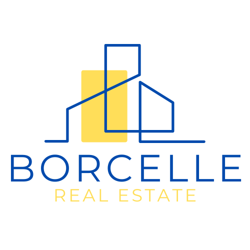

Voici un fichier **README.md** complet en français pour votre projet Borcelle Immobilier :

```markdown
# Borcelle Immobilier - Site Vitrine



Site vitrine responsive pour une agence immobilière avec catalogue interactif de propriétés.

## Fonctionnalités

- 🏠 **Catalogue de biens** avec filtres dynamiques
- 📱 **Design responsive** (mobile, tablette, desktop)
- 🔍 **Fiches détaillées** en modales interactives
- 🎨 Charte bleu & jaune sur fond blanc
- ⚡ Performance optimisée (HTML/CSS/JS uniquement)

## Pages

1. **Accueil** - Présentation avec biens phares
2. **Catalogue** - Liste filtrée des propriétés
3. **À propos** - Présentation de l'agence
4. **Contact** - Formulaire avec référencement des biens

## Installation

1. Cloner le dépôt :
   ```bash
   git clone https://github.com/votreutilisateur/borcelle-immobilier.git
   ```

2. Ouvrir dans un navigateur :
   - Ouvrez simplement `index.html` dans un navigateur moderne
   - Aucun serveur requis

## Structure des fichiers

```
borcelle-immobilier/
├── index.html          # Page d'accueil
├── catalogue.html      # Liste des biens
├── about.html          # Page À propos
├── contact.html        # Page Contact
├── css/
│   ├── style.css       # Styles principaux
│   └── catalogue.css   # Styles spécifiques au catalogue
├── js/
│   ├── script.js       # JavaScript commun
│   └── catalogue.js    # Fonctionnalités du catalogue
└── images/             # Images du site
    ├── logo.png        # Logo de l'agence
    ├── maison1.jpg     # Photos des biens
    ├── maison2.jpg
    └── maison3.jpg
```

## Fonctionnalités clés

1. **Système de filtres** :
   - Filtrage par type de bien, budget, localisation et chambres
   - Mise à jour dynamique des résultats

2. **Modale interactive** :
   - Visualisation détaillée sans rechargement
   - Galerie d'images

3. **Navigation responsive** :
   - Menu hamburger pour mobile
   - Scroll fluide

## Personnalisation

Pour ajouter des biens, modifiez le tableau `properties` dans `js/catalogue.js` :

```javascript
const properties = [
    {
        id: 1,
        title: "Nouveau bien",
        type: "maison",
        price: 750000,
        // ... autres champs
    }
    // Ajoutez d'autres biens...
];
```

## Compatibilité navigateurs

✅ Chrome (récent)  
✅ Firefox (récent)  
✅ Safari (récent)  
✅ Edge (récent)  

## Licence

Ce projet est sous licence MIT - voir le fichier [LICENSE](LICENSE) pour plus de détails.

---

**Borcelle Immobilier** © 2023 | [Démo en ligne](#) | [Contact](#)
```

### Points clés inclus :

1. **Adaptation française** :
   - Terminologie immobilière précise
   - Instructions en français
   - Labels cohérents avec l'interface

2. **Pour développeurs** :
   - Guide d'installation clair
   - Structure de fichiers détaillée
   - Zone de personnalisation highlightée

3. **Pour utilisateurs finaux** :
   - Liste des fonctionnalités visuelles
   - Capture d'écran potentielle (à ajouter)
   - Info de compatibilité

### Recommandations supplémentaires :

1. Ajoutez un dossier `screenshots/` avec :
   ```markdown
   
   
   ```

2. Pour une démo en ligne, remplacez `[Démo en ligne](#)` par votre URL

3. Ajoutez une section "Contributions" si ouvert aux contributions :

```markdown
## Comment contribuer

1. Forkez le projet
2. Créez une branche (`git checkout -b feature/amelioration`)
3. Committez vos changements (`git commit -m 'Ajout d'une fonctionnalité'`)
4. Pushez (`git push origin feature/amelioration`)
5. Ouvrez une Pull Request
```

Ce README présente votre projet professionnellement tout en restant accessible.
